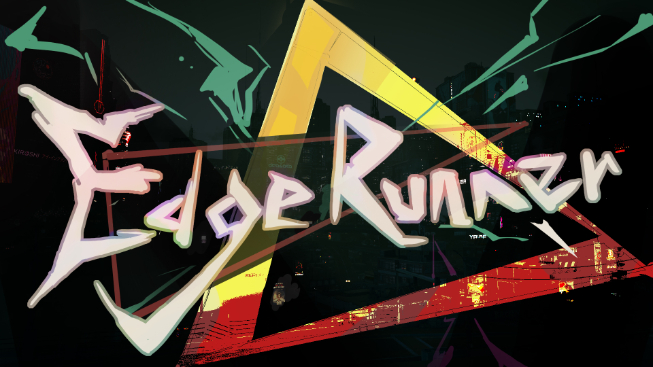

# Edge-Runner

  
*类幽灵行者2D跑酷游戏* - 俯视角跑酷砍杀，主题“闪”。

 

## 📖 项目简介
Gamejam产物，不断更新中。玩家通过“闪”（瞬移）和速度相关的“时缓”技能躲避敌人、接近并斩杀。

## 🎮 游戏预览
 待录制

## 🚀 快速开始
### 环境要求
- Unity 版本：`6000.2.9f1`
- 目标平台：Windows

### 步骤
1. 克隆仓库：`git clone https://github.com/your-repo/Edge-Runner.git`
2. 在 Unity Hub 中打开项目。
3. 在 Scenes/0MainScene.unity 中点击运行

详细见文档

## 🥳 核心功能
- [x] 角色能力（支持冲刺、爬墙、时缓技能）

## 🎯 Roadmap
- [ ] 镜头的移动处理
- [ ] 手柄无障碍全操作
- [ ] 伪3D（类似 APE OUT）
- [ ] 攻击碰撞体处理

## 贡献
欢迎 PR！请遵循 TODO

## 相关链接
[飞书文档](https://pcnem68jjpkx.feishu.cn/wiki/QC82wVzdAis0AnkGeidcENxpn44?from=from_copylink)